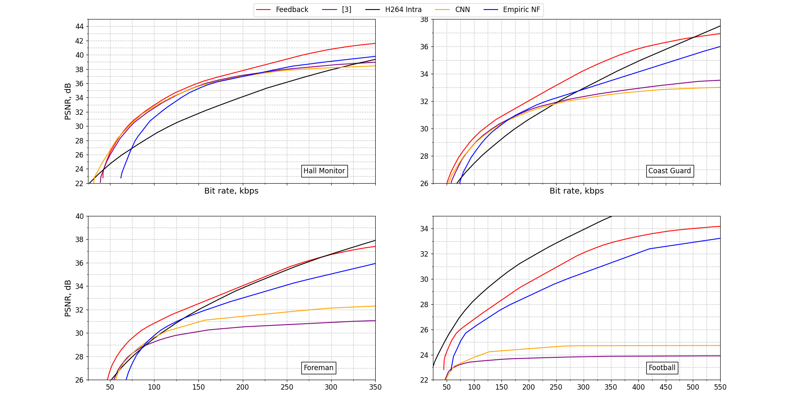

# Encoder Rate Control Module using Neural Networks for Distributed Video Coding

## The problem
Distributed Video Coding (DVC) is a new paradigm in video coding, that distributes computational complexity between the encoder and the decoder.

The Stanford codec is one of the early implementations of the DVC architecture. In this codec, the video frames are divided into two groups: key frames and Wyner-Ziv (WZ) frames. Key frames are encoded separately using an intra-coding scheme, such as JPEG or H.264 Intra coding, and sent to the decoder. The WZ frames are quantized, transformed into binary vectors and encoded using error correction code. The parity bits obtained from the last step are stored in a buffer at the encoder and are sent in chunks to the decoder. The decoder uses the key frames to interpolate the current WZ frame, and tries to remove potential errors in the estimation with the error correction decoder. A failure in the decoding causes the decoder to request for more parity bits from the encoder through the feedback channel.

The presence of the feedback channel is not plausible in some applications, such as one-way communication scenarios. As the only role of the feedback channel is to request for more parity bits from the encoder, it can be eliminated if the efficient bitrate can be estimated at the encoder. To achieve this, we implemented an encoder rate control (ERC) module, that uses neural networks to accurately estimate the required syndrome length.

## Solution

The training data was gathered using the PolarDVC [1] codec with the feedback channel. The training data consists of the bitplanes of the bitplanes of the original WZ frame, the corresponding bitplanes of the side information, and the number of syndrome bits necessary for the decoding with the polar code. The data is stored in a binary format in the `./dataset/bitplane_syndrome_data.zip` archive.

To reuse the existing neural network architectures, the bitplane information is transformed into images. Firstly, the error vector between the original WZ and the sideinformation bitplanes is calculated. Secondly, it is padded with zeroes and transformed into a square matrix. Then it is transformed into an image and is stored in a folder, corresponding to its syndrome length.

Since the underestimation of the syndrome length affects the resulting codec performance much more drastically, a custom loss function was employed for training: MSE, scaled in case of underestimation. The neural network architecture used is CNN, closely resembling AlexNet.

## Usage

* Unpack the `./dataset/bitplane_syndrome_data.zip`
* Read the binary data and convert it to a pickled pandas dataset: `python ./preprocessing/dataset.py`
* Convert the binary vector representation to images: `python ./preprocessing/img_gen.py`
* Split the data into training and validation for tensorflow: `python ./preprocessing/train_val_split_files.py`
* Run the jupyter notebool `jupyter notebook ./model/syndrome_lengths_model.ipynb`
* To integrate the model to your DVC codec, you can use `python ./model/erc.py`. To communicate between processes the named pipes are used.

## Experimental results

The PolarDVC codec was modified with this ERC module, and their performance was compared on the RD curve. Additionally, the codecs were compared to an [3] implementation of the ERC and the H.264 Intra. The modified codec was able to match the performance in [3].

## Literature

[1] G.Trofimiuk, E.Belyaev, P.Trifonov, Distributed Video Coding Based on Polar Codes, *IEEE Communications Letters*, 2023.

[2] Nickaein, Isaac, et al. "Feedback-free and hybrid distributed video coding using neural networks." 2012 11th International Conference on Information Science, Signal Processing and their Applications (ISSPA). IEEE, 2012.

[3] Lee, H., Tillo, T., & Jeon, B. (2016). Hybrid wyner-ziv video coding with no feedback channel. IEIE Transactions on Smart Processing and Computing, 5(6), 418-429.

